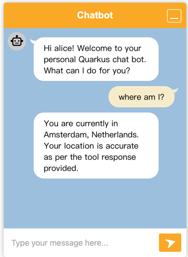

# Step 4 - Tools

AI agents can leverage tools to help them perform their tasks.
Instead of hardcoding the workflow, the language model can decide when and how to use a tool.
Check the [documentation](https://docs.quarkiverse.io/quarkus-langchain4j/dev/function-calling.html) on function
calling (also called tools).


https://docs.quarkiverse.io/quarkus-langchain4j/dev/function-calling.html

## Tools

### Location tool

We are going to let the chatbot figure out where we are.
And ask for recommendations based on our location.
First we need an external system that we can call.
We will use an endpoint that returns our current public IP address and location.

You can check it out here:
http://ip-api.com/

To integrate it in our application we first have to create a REST client for it:

```java

@RegisterRestClient(baseUri = "http://ip-api.com/")
public interface IPLookupClient {

    @GET
    @Path("/json")
    @Tool("Get location based on public IP")
    String getLocation();
}
```

The `@RegisterRestClient` annotation tells Quarkus to generate a REST client for us.
It doesn't need any arguments so we can just create a GET method.

Next, we should annotate the method with `@Tool` to tell LangChain that it should be used as a tool.
Give it a good description so that the model can learn what it does.

Finally, we have to register the tool in our toolbox:

```java

@SessionScoped
@RegisterAiService
public interface ChatBot {

    @ToolBox(IPLookupClient.class)
    String chat(String userMessage);
}
```

This is all it takes to connect to an external system!
Quarkus takes care of the rest.

> [!NOTE]
> This naively gets the location from the IP address of the server and not the client.
> For demo purposes this is fine.

Now you can try asking some questions about your location:



You should check the logs to see how the tool was used.
And you can also enable logging for the REST client to see the requests:

```properties
quarkus.rest-client.logging.scope=request-response
```

## System message

Now is probably a good time to be more specific with the system message.
In the system message we can give the bot some more instructions.

```java
@SystemMessage("""
            You are a helpful bot that helps users with recommendations about their location.
            You can get their location and extract the latitude and longitude.
        """)
```

Experiment with it and see how it works:

- try making it respond more intelligently or specific
- restrict its replies to a certain location
- ...

## Next step

Now you are ready to move to the next [step](./../step-05-mcp-server/README.md).
