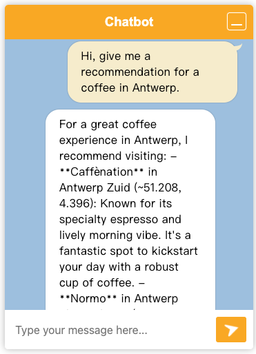

# Step 7 - Retrieval-Augmented Generation (RAG)

We’ll ingest one or more docs into a local knowledge base and let the bot answer
questions **grounded on those docs**. For this workshop, we’ll use a playful resource:

> `src/main/resources/rag/city-guide.txt`
 
It contains a guide on places to visit in Rotterdam and Antwerp!
The bot should rely on this guide. If relevant info is missing, it should say so.

In this step, we’ll implement:
1. **Ingestion** – split the doc, embed its content, store the content.
2. **Augmentation** – retrieve relevant chunks and inject them into the prompt.

[//]: # (Pick one track &#40;don’t run both at the same time&#41;:)

[//]: # (- **7A. EasyRAG &#40;zero code, fastest&#41;**)

[//]: # (- **7B. Minimal DIY RAG &#40;in-memory, no DB, shows the moving parts&#41;**)

---

## EasyRAG
This is the easiest way to get RAG up and running. It requires zero custom code.
It uses an in-memory vector store, so it’s not suitable for production, but it’s
great for demos and workshops.

### 1) Add the extension
`pom.xml`
```xml
<dependency>
  <groupId>io.quarkiverse.langchain4j</groupId>
  <artifactId>quarkus-langchain4j-easy-rag</artifactId>
</dependency>
```

> [!NOTE]
> `./mvnw quarkus:add-extension -Dextension=easy-rag`

### 2) Add a local embedding model (to avoid remote calls)

We’ll use the small ONNX BGE model that runs locally. Add a dependency for the model to `pom.xml`:
```xml
<dependency>
  <groupId>dev.langchain4j</groupId>
  <artifactId>langchain4j-embeddings-bge-small-en-q</artifactId>
</dependency>
```

Now that we have included the model, we need to configure EasyRAG to use it and also point it to the folder where we will drop our docs.
Inside of `src/main/resources/application.properties`, add the following:
```properties
# EasyRAG watches this folder and ingests on startup
quarkus.langchain4j.easy-rag.path=src/main/resources/rag
quarkus.langchain4j.easy-rag.max-segment-size=100
quarkus.langchain4j.easy-rag.max-overlap-size=25
quarkus.langchain4j.easy-rag.max-results=15

# Use the local ONNX embedding model
quarkus.langchain4j.embedding-model.provider=dev.langchain4j.model.embedding.onnx.bgesmallenq.BgeSmallEnQuantizedEmbeddingModel
```

For more information on these properties, see the [easy-rag docs](https://quarkiverse.github.io/quarkus-langchain4j/dev/easy-rag/).

On the application startup, EasyRAG will:
1. Scan the folder for documents.
2. Split them into chunks (segments) of max 100 tokens with an overlap of 25 tokens.
3. Embed the chunks using the specified embedding model.
4. Store the embeddings in an in-memory vector store.

Here is an example of what you should see in the logs on startup:
```log
INFO  [io.qua.lan.eas.run.EasyRagIngestor] (Quarkus Main Thread) Ingesting documents from filesystem: src/main/resources/rag, path matcher = glob:**, recursive = true
INFO  [io.qua.lan.eas.run.EasyRagIngestor] (Quarkus Main Thread) Ingested 1 files as 17 documents
```


### 3) Drop a doc
Create `src/main/resources/rag/workshop-field-guide.txt`. (A sample file has been provided in the repo.)

We will keep it small for the workshop purposes.
EasyRAG supports many formats, see [docs](https://quarkiverse.github.io/quarkus-langchain4j/dev/easy-rag/).
These are most commonly used formats that are supported: `.txt`, `.md`, `.pdf`, `.docx`.

### 4) Update bot system message
To make the bot more aware, let's add "You use provided information to you about city guides." to the system message.

```
@SystemMessage("""
                You are a helpful bot that helps users with recommendations about their location.
                You can get their location and extract the latitude and longitude.
                You use provided information to you about city guides.
            """)
```

### 5) Run and test

Boot up the app:
```bash
./mvnw quarkus:dev
```

- Watch logs on startup for ingestion you should see EasyRAG ingesting and chunking the file.
- Open the _Dev UI_ > _LangChain4j_ > _Embedding store_ and try a search (e.g., "Wi-Fi", "Allowed HTTPS").
- Ask your bot:
  - “What are good restaurants in Rotterdam?” — It should answer and cite the guide (e.g., “Fenix Food Factory”).
  - “Give me a recommendation for a coffee place in Antwerp” — (e.g., “Normo”).
  

Here is an example of how a model replut might look like:



Notice, that the model contains the relevant context from the guide and cites it. This answer was generated with OpenAI's `gpt-4o` model.
Unfortunately, smaller models are not great at following such instructions, especially when the input prompt becomes longer,
which is the case with RAG.

> [!NOTE] Model choice will affect the quality of the answers. If you use a small model (e.g., `llama3.2`), the bot may not be able to answer all questions correctly. For better results, consider using a more capable model like `gpt-4o` from OpenAI.

[//]: # (---)

[//]: # ()
[//]: # (## 7B — Minimal DIY RAG &#40;in-memory, no DB&#41;)

[//]: # (This track shopws the essential RAG components without a vector database.)

[//]: # ()
[//]: # (> [!IMPORTANT] **Do not enable EasyRAG at the same time** &#40;comment the EasyRAG dependency if you switch to 7B&#41;.)

[//]: # ()
[//]: # (### 1&#41; Dependency &#40;local embedding model&#41;)

[//]: # (Similar to 7A, we’ll use the small ONNX BGE model that runs locally. Add a dependency for the model to `pom.xml`:)

[//]: # (```xmlxml)

[//]: # (<dependency>)

[//]: # (  <groupId>dev.langchain4j</groupId>)

[//]: # (  <artifactId>langchain4j-embeddings-bge-small-en-q</artifactId>)

[//]: # (</dependency>)

[//]: # (```)

[//]: # ()
[//]: # (### 2&#41; Configurations)

[//]: # ()
[//]: # (We need to indicate where our docs live and ensure the same embedding model is used for ingestion & retrieval.)

[//]: # (In `src/main/resources/application.properties`,)

[//]: # (```properties)

[//]: # (# Where your docs live)

[//]: # (rag.location=src/main/resources/rag)

[//]: # ()
[//]: # (# Ensure the same embedding model is used for ingestion & retrieval)

[//]: # (quarkus.langchain4j.embedding-model.provider=dev.langchain4j.model.embedding.onnx.bgesmallenq.BgeSmallEnQuantizedEmbeddingModel)

[//]: # (```)

[//]: # ()
[//]: # (## 3&#41; In-Memory embedding store)


> [!NOTE]
> That’s it. You now have RAG with a minimal code added.

## Next step

Now you are ready to move to the next [step](./../step-bonus-01-observability/README.md).